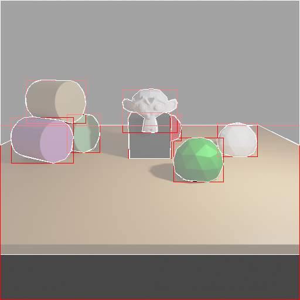

# COCO annotations



The focus of this example is to introduce user to `writer.CocoAnnotationsWriter` module.

## Usage

Execute in the Blender-Pipeline main directory:

```
python run.py examples/coco_annotations/config.yaml examples/coco_annotations/camera_positions examples/coco_annotations/scene.obj examples/coco_annotations/output
```

* `examples/coco_annotations/config.yaml`: path to the configuration file with pipeline configuration.
* `examples/coco_annotations/camera_positions`: text file with parameters of camera positions.
* `examples/oco_annotations/scene.obj`: path to the object file with the basic scene.
* `examples/oco_annotations/output`: path to the output directory.

## Steps

* Loads `scene.obj`: `loader.ObjectLoader` module.
* Creates a point light: `lighting.LightLoader` module.
* Loads camera positions from `camera_positions`: `camera.CameraLoader` module.
* Renders normals: `renderer.NormalRenderer` module.
* Renders rgb: `renderer.RgbRenderer` module.
* Renders instance segmentation: `renderer.SegMapRenderer` module.
* Writes coco annotations: `writer.CocoAnnotationsWriter` module.
* Writes the output to .hdf5 containers: `writer.Hdf5Writer` module.

## Config file

### CocoAnnotationsWriter

```yaml
  {
    "module": "writer.CocoAnnotationsWriter",
    "config": {
    }
  }
```

This modules depends on output from `renderer.SegMapRenderer` and stores annotations in `coco_annotations.json`.

### Visualizing Annotations

You can use vis_coco_annotation.py like following to visualize annotation over a rendered rgb image:

```
python scripts/vis_coco_annotation.py [-i <hdf5 index>] [-c <coco annotations json>] [-b <base path for the files>]
```

### Working Examples

With specific values:

```
python scripts/vis_coco_annotation.py -i 1 -c coco_annotations.json -b examples/coco_annotations/output
```

Above are also the default values, i.e. for the same result call:

```
python scripts/vis_coco_annotation.py
```

## More examples

* [suncg_basic](../suncg_basic): Rendering SUNCG scenes with fixed camera poses.
* [suncg_with_cam_sampling](../suncg_with_cam_sampling): Rendering SUNCG scenes with dynamically sampled camera poses.