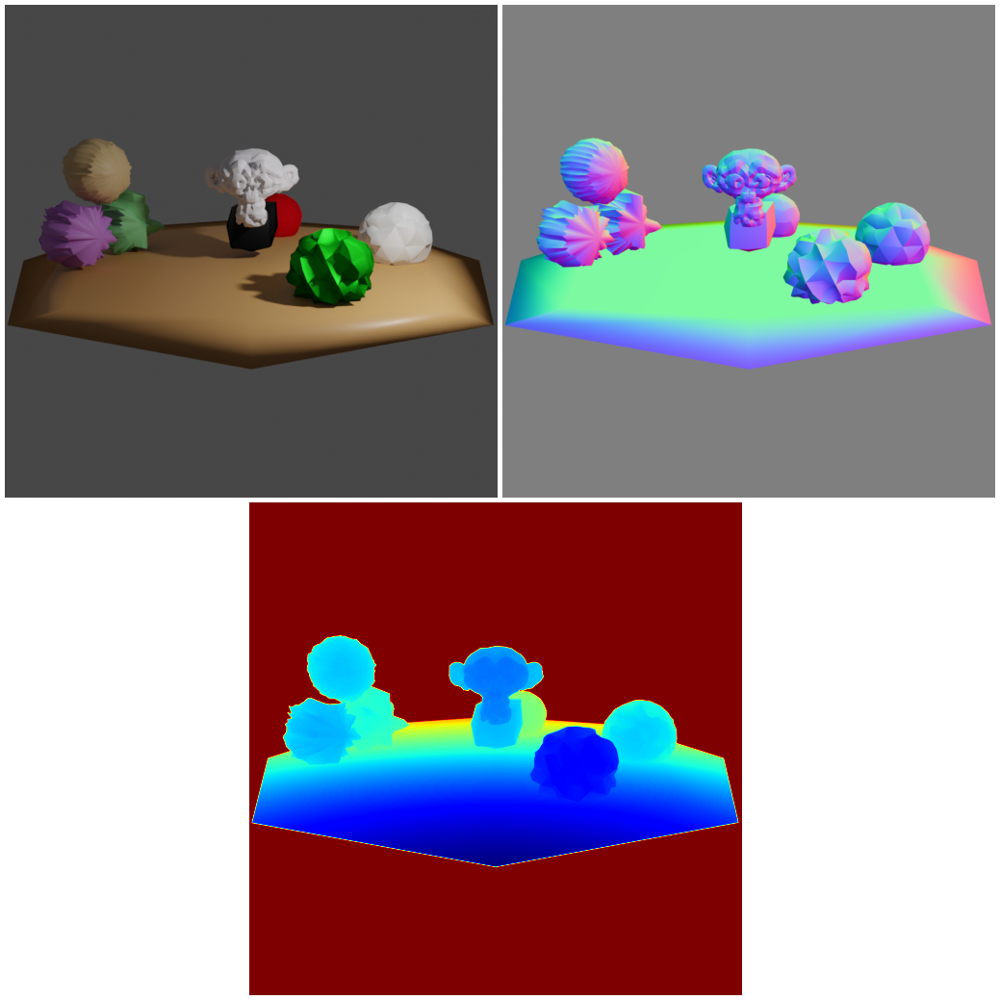

# Object selection and manipulation using displacement modifier



In this example we demonstrate how to manipulate a entity by adding different displacement modifiers with different textures as part of the `EntityManipulator` module.
This is an advanced example, please make sure that you have read:

* [entity_manipulator](../shapenet): Basics of `EntityManipulator` module to load entities and manipulate them. 
## Usage

Execute this in the BlenderProc main directory:

```
python run.py examples/entity_displacement_modifier/config.yaml examples/entity_displacement_modifier/scene.obj examples/entity_displacement_modifier/output
```

* `examples/entity_displacement_modifier/config.yaml`: path to the configuration file with pipeline configuration.
* `examples/entity_displacement_modifier/scene.obj`: path to the object file with the basic scene.
* `examples/entity_displacement_modifier/output`: path to the output directory.

## Visualization

Visualize the generated data:

```
python scripts/visHdf5Files.py examples/entity_displacement_modifier/output/0.hdf5
```

## Steps

* Loads `scene.obj`: `loader.ObjectLoader` module.
* Creates a point light: `lighting.LightLoader` module.
* Sets two camera positions: `camera.CameraLoader` module.
* Selects objects based on the condition: `manipulators.EntityManipulator` module.
* Change some parameters of the selected entities: `manipulators.EntityManipulator` module. 
* Renders rgb, normals and depth: `renderer.RgbRenderer` module.
* Writes the output to .hdf5 containers: `writer.Hdf5Writer` module.

## Config file

### EntityManipulator

```yaml
    {
      "module": "manipulators.EntityManipulator",
      "config": {
        "selector": {
          "provider": "getter.Entity",
          "conditions": {
            "type": "MESH" # this guarantees that the object is a mesh, and not for example a camera
          }
        },
        "cf_add_uv_mapping":{
          "provider": "getter.Content",
          "content": {
            "projection": "cylinder"
          }
        },
        "cf_add_displace_modifier_with_texture": {
          "provider": "getter.Content",
          "content": {
              "texture": {
                "provider": "sampler.Texture"
              },
              "min_vertices_for_subdiv": 10000,
              "mid_level": 0.5,
              "subdiv_level": {
                "provider": "sampler.Value",
                "type": "int",
                "min": 1,
                "max": 3
              },
              "strength": {
                "provider": "sampler.Value",
                "type": "float",
                "mode": "normal",
                "mean": 0.0,
                "std_dev": 0.5
              }
          }

        }
      }
    },
```

The focus of this example are the custom functions `cf_add_displacement_modifier_with_texture` and `cf_add_uv_mapping` of the EntityManipulator module.
We are selecting multiple entities based on a user-defined condition and change the attribute and custom property values of the selected entities.
First we want to check if each entity has a uv_map and if not, we add a uv_map to the entity. Than we add a displacement modifier with a random texture to each entity. 

1.) `cf_add_uv_mapping` - section of the `EntityManipulator` for adding a uv map to an object if uv map is missing.

* This step is mandatory for adding a displacement modifier to an object, if the object doesn't have a uv_map. Because if a object doesn't have a uv_map it is not possible to put a texture over it. And without texture a displacement is not possible. 
For the UV mapping we have to chose a `projection`. Possible projection types given by blender are: "cube", "cylinder", "smart" and "sphere".

2.) `cf_add_displacement_modifier_with_texture` - section of the `EntityManipulator` for adding a displacement modifier with texture to an entity.

* First we need a `texture` to lay over the object. This can be a random or a specific texture. For possible `texture`'s data types check `provider.sampler.Texture` documentation.
* All other, following parameter are not mandatory but can be used to further customize the displacement.
* By adding a value to `min_vertices_for_subdiv` we can check if a subdivision modifier is necessary for the entity. If the vertices of a entity are less than `min_vertices_for_subdiv` a Subdivision modifier will be added to increase the number of vertices. The number of vertices of a entity has a big effect on the displacement modifier. If there are not enough vertices, the displacement modifier will not work well.                                                                         
* If a subdivision is being applied the `subdiv_level` defines the numbers of subdivisions to perform on the entity. We are using one or two in this example.
* `mid_level` is the texture value which will be treated as no displacement by the modifier. Texture values below this threshold will result in negative displacement along the selected direction, while texture values above it will result in positive displacement. `displacement = texture_value - mid_level`. Recall that color/luminosity values are typically between (0.0 to 1.0) in Blender, and not between (0 to 255).
* `strength` is the amount to displace geometry. We are here sampling the `strength` over a gaussian distribution with mean `0.0` and standard deviation of `0.5`.

## More examples

* [camera_sampling](../camera_sampling): More on sampling for cameras.
* [light_sampling](../light_sampling): More on sampling for lights.
* [entity_manipulation](../entity_manipulation): More on using the EntityManipulator module.
