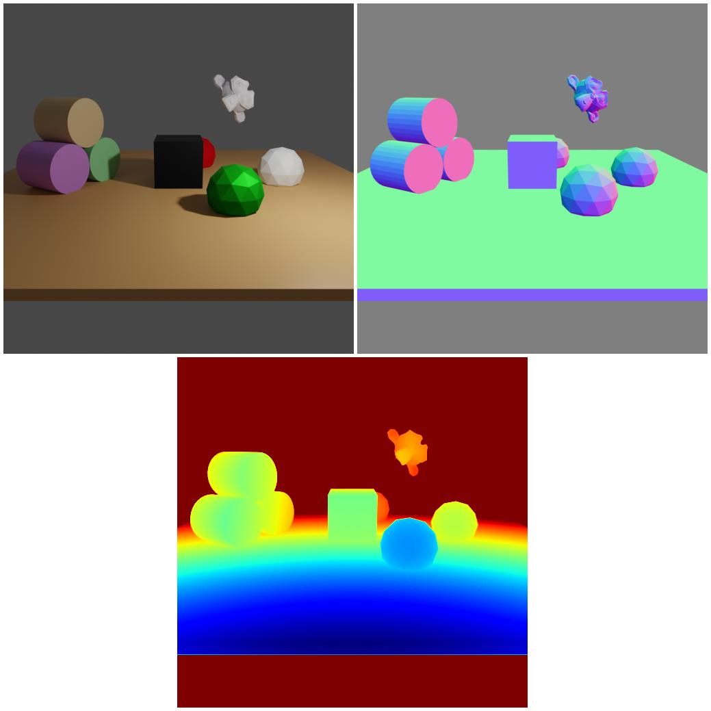

# Object selection and manipulation



In this example we demonstrate how to select entities in the scene using `getter.Entity` and then manipulate then using the `EntityManipulator` module.

## Usage

Execute this in the BlenderProc main directory:

```
python run.py examples/entity_manipulation/config.yaml examples/entity_manipulation/scene.obj examples/entity_manipulation/output
```

* `examples/entity_manipulation/config.yaml`: path to the configuration file with pipeline configuration.
* `examples/entity_manipulation/scene.obj`: path to the object file with the basic scene.
* `examples/entity_manipulation/output`: path to the output directory.

## Visualization

Visualize the generated data:

```
python scripts/visHdf5Files.py examples/entity_manipulation/output/0.hdf5
```

## Steps

* Loads `scene.obj`: `loader.ObjectLoader` module.
* Creates a point light: `lighting.LightLoader` module.
* Sets two camera positions: `camera.CameraLoader` module.
* Selects objects based on the condition: `manipulators.EntityManipulator` module.
* Change some parameters of the selected entities: `manipulators.EntityManipulator` module.
* Renders rgb: `renderer.RgbRenderer` module plus normals.
* Writes the output to .hdf5 containers: `writer.Hdf5Writer` module.

## Config file

### EntityManipulator

```yaml
    {
      "module": "manipulators.EntityManipulator",
      "config": {
        "selector": {
          "provider": "getter.Entity",
          "conditions": {
            "name": 'Suzanne',
            "type": "MESH" # this guarantees that the object is a mesh, and not for example a camera
          }
        },
        "location": {
          "provider": "Uniform3dSampler",
          "max":[1, 2, 3],
          "min":[0, 1, 2]
        },
        "rotation_euler": [1, 1, 0],
        "cp_physics": True
      }
    },
```

The focus of this example is the EntityManipulator module and `getter.Entity` which allow us to select multiple entities based on a user-defined condition and change the attribute and custom property values of the selected entities.
* `selector` - section of the `EntityManipulator` for stating the chosen `provider` and the `condition` to use for selecting.

Our condition is: `"name": 'Suzanne'` *and* `"name": "MESH"`, which means that we want to select all the objects with `obj.name == 'Suzanne'` and which are of `"type": "MESH"`. In our case we have only one object which meets the requirement.
Yet one may define any condition where `key` is the valid name of any attribute of entities present in the scene or the name of an existing custom property.
This way it is possible to select multiple objects. One may try this condition to try multiple object selection: `"location": [0, 0, 0]`

NOTE: any given attribute_value of the type string will be treated as a *REGULAR EXPRESSION*, so `"name": 'Cylinder.*'` condition will select us all three cylinders in the scene.

For possible `attribute_name`'s data types check `provider.getter.Entity` documentation.

After `selector` section we are defining attribute name and attribute value pairs in the familiar format of {attribute_name: attribute_value}.
If attribute_name is a valid name of any attribute of selected object(s), its value will be set to attribute_value.
If attribute_name is a name of an existing custom property, its value will be set to attribute_value.
If attribute_name is not a valid name of any attribute nor it is a name of an existing custom property, it will be treated as a name for a new custom property, and its value will be set to attribute_value.

In our case we sample the `location` attribute's value of the selected object using `Uniform3d` sampler, set the value of the `rotation_euler` attribute to `[1, 1, 0]`, and create new custom property `physics` and set it's value to `True`.
By default for each selected object defined samplers will be called. 
If one wants to have values sampled once and have them set to defined attribute/properties, set `"mode": "all"` at the end of this section. 

## More examples

* [camera_sampling](../camera_sampling): More on sampling for cameras.
* [light_sampling](../light_sampling): More on sampling for lights.
