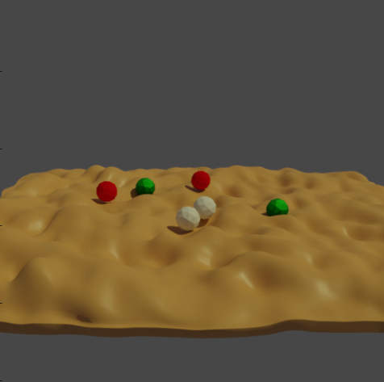

# Physics positioning



## Usage

Execute in the Blender-Pipeline main directory:

```
python run.py examples/physics_positioning/config.yaml examples/physics_positioning/output
```

This example places some spheres randomly across a bumpy plane without any intersections between objects.
This is done via a physics simulation where the spheres are first placed randomly above the plane and then are influenced by gravity such that they fall down upon the plane until they find a new resting positon.

## Steps

* Loads `active.obj` (6 spheres) with `"physics" = ACTIVE`
* Randomly places them
* Loads `passive.obj` (one bumpy plane) with `"physics" = PASSIVE`
* Adds a camera and a light
* Runs the physics simulation
* Renders rgb

## Explanation of the config file

### Load spheres and position them randomly
```yaml
{
  "name": "loader.ObjLoader",
  "config": {
    "path": "examples/physics_positioning/active.obj",
    "physics": "active"
  }
},
{
  "name": "object.PositionSampler",
  "config":{
    "pos_sampler":{
      "name":"Uniform3dSampler",
      "parameters":{
        "max":[5, 5, 8],
        "min":[-5, -5, 12]
      }
    },
    "rot_sampler":{
      "name":"Uniform3dSampler",
      "parameters":{
        "max":[0, 0, 0],
        "min":[6.28, 6.28, 6.28]
      }
    }
  }
},
```

* Load spheres from obj file and set physics to `active`, so that they will later be influenced by gravity
* Uses the PositionSampler to place them randomly above the plane
 
 
### Load plane

```yaml
{
  "name": "loader.ObjLoader",
  "config": {
    "path": "examples/physics_positioning/passive.obj"
  }
}
```

* Load the plane from an obj file 
* Physics will be automatically set to `passive`
* As we load this object after the `PositionSampler`, the location of the plane is not changed

### Run simulation

```yaml
{
  "name": "object.PhysicsPositioning",
  "config": {
    "min_simulation_time": 4,
    "max_simulation_time": 20,
    "check_object_interval": 1
  }
},
```

* When running the physics simulation the module checks in intervals of 1 second, if there are still objects moving. If this is not the case, the simulation is stopped. Nevertheless the simulation is run at least for 4 seconds and at most for 20 seconds.
* In this way all ACTIVE objects (the spheres) will be influenced by gravity and fall down until they hit the bumpy plane
* At the end of the simulation the position of all spheres is made fixed again