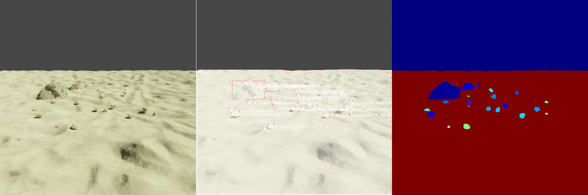

# Rock Essentials Dataset



The focus of this example is the `RockEssentialsLoader` module that allows us to load models and textures from the [Rock Essentials](https://blendermarket.com/products/the-rock-essentials) (RE) dataset.

## Usage

Execute in the BlenderProc main directory:

```
python run.py examples/rock_essentials/config.yaml ${PATH_TO_RE_DATASET} examples/rock_essentials/camera_positions examples/rock_essentials/output
``` 

* `examples/rock_essentials/config.yaml`: path to the configuration file with pipeline configuration.
* `${PATH_TO_RE_DATASET}`: path to the downloaded rock essential dataset 
* `examples/rock_essentials/camera_positions`: text file with parameters of camera positions.
* `examples/rock_essentials/output`: path to the output directory.

## Steps

* Loads RE rocks and constructs a ground plane: `loader.RockEssentialsLoader` module.
* Samples positions on the ground plane for boulders: `lobject.EntityManipulator` module.
* Sample positions for rocks: `object.ObjectPoseSampler` module.
* Loads camera positions from `camera_positions`: `camera.CameraLoader` module.
* Creates a Sun light : `lighting.LightLoader` module.
* Runs the physics simulation: `object.PhysicsPositioning` module.
* Renders rgb: `renderer.RgbRenderer` module.
* Renders instance segmentation: `renderer.SegMapRenderer` module.
* Writes coco annotations: `writer.CocoAnnotationsWriter` module.
* Writes the output to .hdf5 containers: `writer.Hdf5Writer` module.

## Config file

### Rock Essentials Loader

```yaml
{
  "module": "loader.RockEssentialsLoader",
  "config": {
    "rocks": [
    {
      "path": "<args:0>/Rock Essentials/Individual Rocks/Sea/Rocks_Sea_Large.blend",
      "objects": ['Rock_1', 'Rock_2','Rock_3'],
      "physics": False,
      "render_levels": 2,
      "high_detail_mode": True,
    },
    {
      "path": "<args:0>/Rock Essentials/Individual Rocks/Granite/Rocks_Granite_Medium.blend",
      "amount": 20,
      "physics": True,
      "render_levels": 2,
      "high_detail_mode": True
    },
    {
      "path": "<args:0>/Rock Essentials/Individual Rocks/Volcanic/Rocks_Volcanic_Small.blend",
      "amount": 20,
      "physics": True,
      "render_levels": 2,
      "high_detail_mode": True
    },
    ],
    "ground": {
      "shader_path": "<args:0>/Rock Essentials/Individual Rocks/Volcanic/Rocks_Volcanic_Small.blend",
      "images": {
        "image_path": "<args:0>/Rock Essentials/Ground Textures/Sand/RDTSandWavy001/",
        "maps": {
          "color": "RDTSandWavy001_COL_VAR1_3K.jpg",
          "roughness": "RDTSandWavy001_GLOSS_3K.jpg",
          "reflection": "RDTSandWavy001_REFL_3K.jpg",
          "normal": "RDTSandWavy001_NRM_3K.jpg",
          "displacement": "RDTSandWavy001_DISP16_3K.tif"
        }
      },
      "plane_scale": [20, 20, 1],
      "subdivision_cuts": 30,
      "subdivision_render_levels": 2,
      "displacement_strength": 0.7
    }
  }
}
```

This module allows us to integrate the RE's models into our dataset.
In `rocks` we are specifying batches of rocks to load by defining:
* `path` to the .blend file with the models,
* `amount` of rocks or the names (`objects`) to load,
* the `physics` state of the rocks of this batch,
* number of subdivisions (`render_levels`) to perform while rendering,
* and whether to enable the HDM when possible.

In `ground` we are defining a realistically-looking ground plane by specifying:
* `shader_path` for a ground plane,
* path to `color`, `roughness`, `reflection`, `normal` and `displacement` maps in `images/image_path`,
* map files names in `maps`,
* scale of the plane `plane_scale`,
* `subdivision_cuts` and `subdivision_render_levels` to perform on a ground plane,
* and a `displacement_strength` of the displacement modifier.

### Physics Positioning

```yaml
{
  "module": "object.PhysicsPositioning",
  "config": {
    "min_simulation_time": 2,
    "max_simulation_time": 4,
    "check_object_interval": 1,
    "solver_iters": 25,
    "steps_per_sec": 250
  }
},
```

Sometimes small objects that are `"physics": True` (just like rocks) can bug through the plane which is `"physics": True` (just like our ground plane) during the animation.
To counter this, we are setting two new parameters to `object.PhysicsPositioning` module:
* `"solver_iters"`: Number of constraint solver iterations made per simulation step.
* `"steps_per_sec"`: Number of simulation steps taken per second. 

Which usually helps.

## Visualization

Visualize the generated data:

```
python scripts/visHdf5Files.py examples/rock_essentials/output/0.hdf5
```

## More examples

* [sung_basic](../suncg_basic): More on rendering SUNCG scenes with fixed camera poses.
* [suncg_with_cam_sampling](../suncg_with_cam_sampling): More on rendering SUNCG scenes with dynamically sampled camera poses.